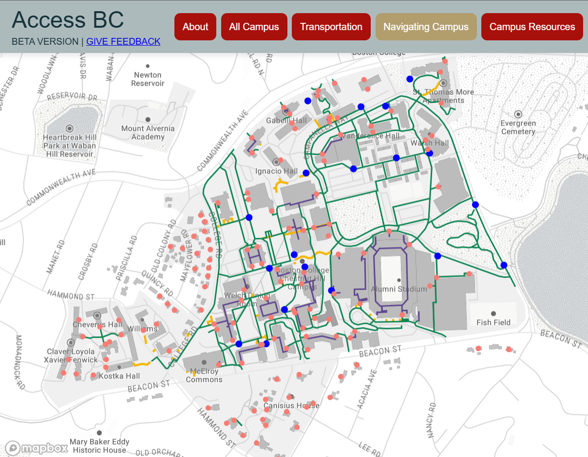
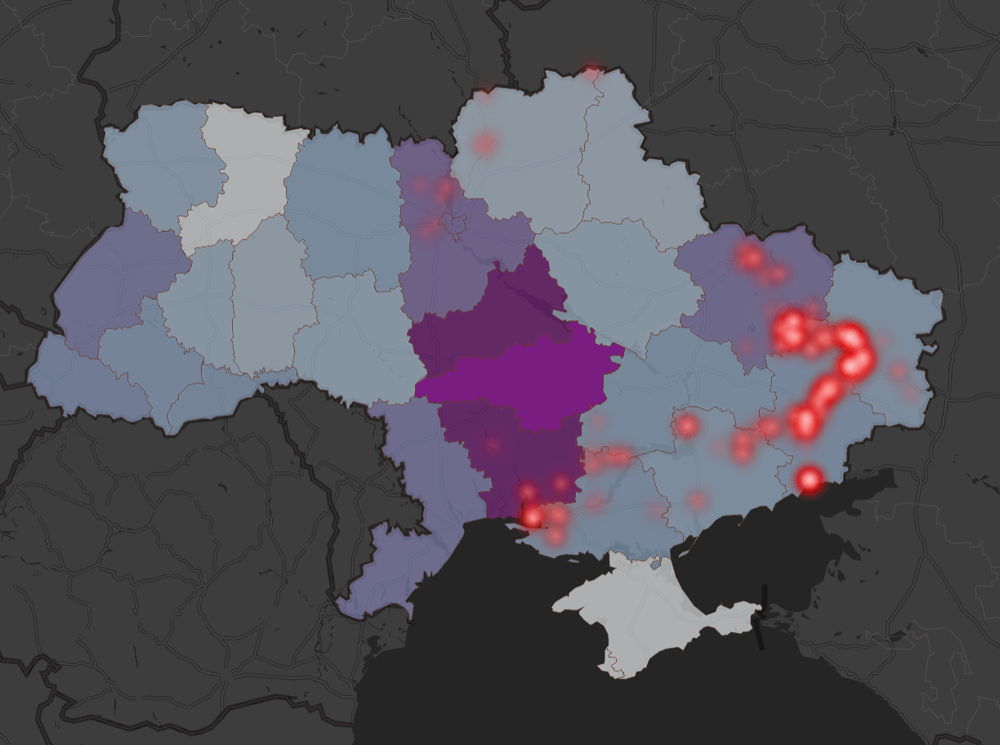
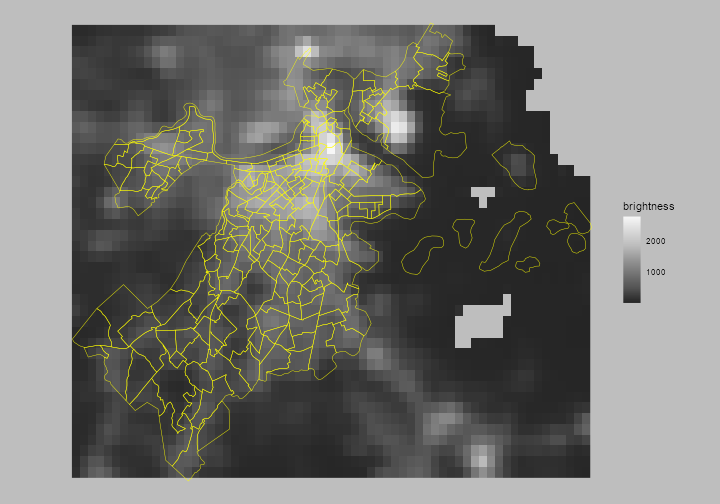
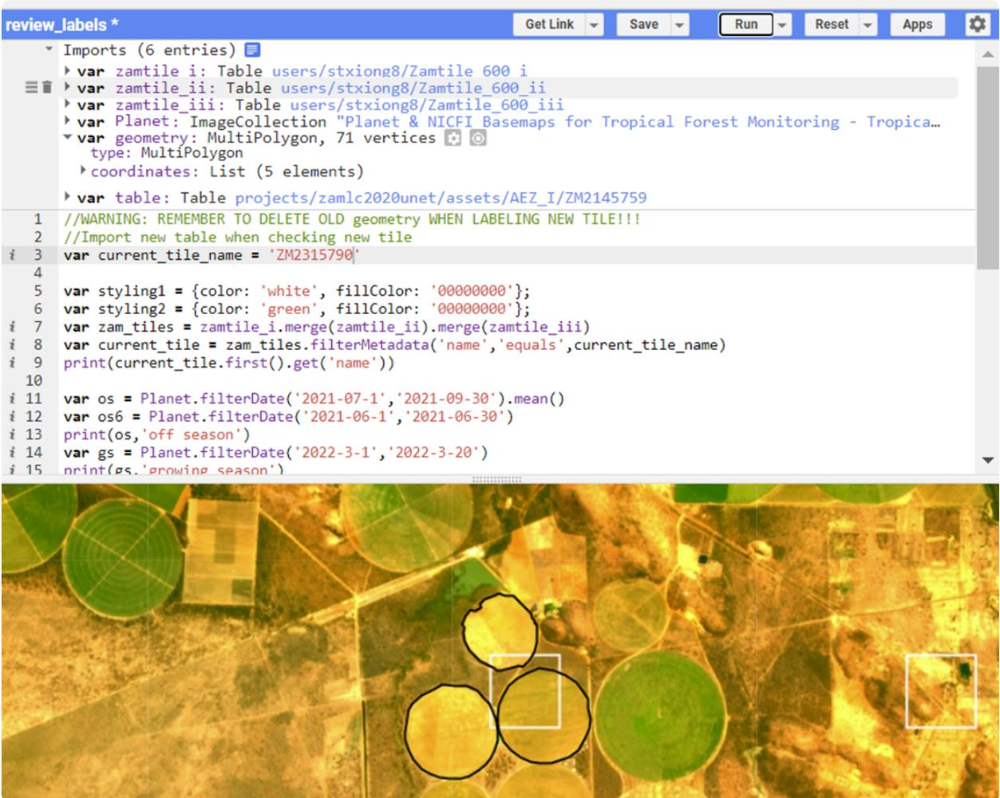
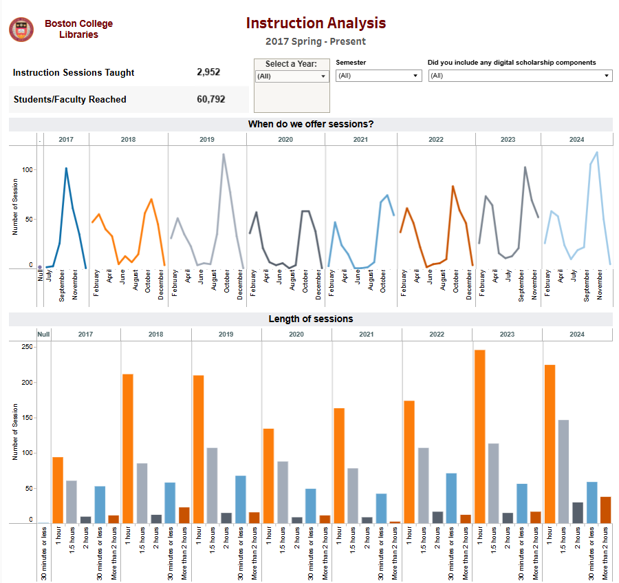
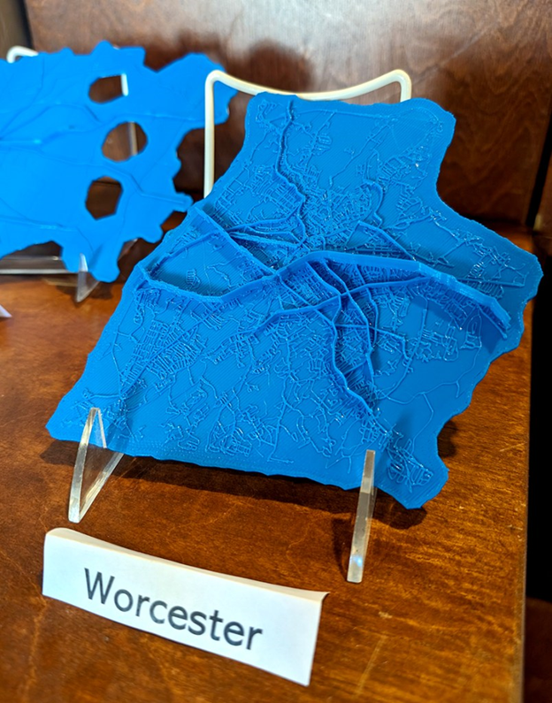

<link rel="stylesheet" href="assets/css/normalize.css">
<link rel="stylesheet" href="assets/css/main.css">
<main id="main"> <!-- Favicon Information -->

   

      <h1 class="text-2xl font-bold">Interactive Maps</h1>
   

  
<a href="assets/work/accessbc.html" class="index-work-section" id="accessbc">
    
    

        <h2>Access BC</h2>
    

    <ul class="skills">
        <li>Mapbox</li>
        <li>Web-Mapping</li>
        <li>Survey123</li>
        <li>JavaScript</li>
    </ul>
    </a>

  
<a href="assets/work/fatalencounters.html" class="index-work-section" id="fatalencounters">
    
    

        <h2>Fatal Encounters with Police</h2>
    

    <ul class="skills">
        <li>Tableau</li>
        <li>Web-Mapping</li>
        <li>ArcGIS Pro</li>
    </ul>
    </a>

  
<a href="assets/work/mappingukraine.html" class="index-work-section" id="ukraine">
    
    

        <h2>Mapping Tweets in Ukraine</h2>
    

    <ul class="skills">
        <li>Mapbox</li>
        <li>Web-Mapping</li>
        <li>Python</li>
    </ul>
    </a>

   

      <h1 class="text-2xl font-bold">GIS Programming</h1>
   

  
<a href="assets/work/nightlights.html" class="index-work-section" id="nightlights">
    
    

        <h2>Public Housing and Nighttime Lights</h2>
    

    <ul class="skills">
        <li>R</li>
        <li>Remote Sensing</li>
    </ul>
    </a>

      
<a href="assets/work/cropland.html" class="index-work-section" id="cropland">
          
    

        <h2>Cropland Mapping in Zambia</h2>
    

    <ul class="skills">
        <li>Google Earth Engine</li>
        <li>Remote Sensing</li>
        <li>Machine Learning</li>
    </ul>
    </a>

   

      <h1 class="text-2xl font-bold">Data Visualization & Analytics</h1>
   

  
<a href="assets/work/bcltableau.html" class="index-work-section" id="nightlights">
    
    

        <h2>Library Analytics</h2>
    

    <ul class="skills">
        <li>Tableau</li>
        <li>Data Collection</li>
    </ul>
    </a>

      
<a href="assets/work/tactile.html" class="index-work-section" id="cropland">
          
    

        <h2>3D-Printing Maps</h2>
    

    <ul class="skills">
        <li>ArcGIS Pro</li>
        <li>Blender</li>
        <li>3D Printing</li>
    </ul>
    </a>

   

      <h1 class="text-2xl font-bold">Static Maps <em>*Coming Soon*</em></h1>
   

  
<a href="assets/work/bcstatic.html" class="index-work-section" id="bcstatic">
    <!--  -->
    

        <h2>Boston College</h2>
    

    <ul class="skills">
        <li>ArcGIS Pro</li>
    </ul>
    </a>

      
<a href="assets/work/clarkstatic.html" class="index-work-section" id="sharepoint">
    <!--  -->
    

        <h2>Clark University</h2>
    

    <ul class="skills">
        <li>ArcGIS Map</li>
        <li>ArcGIS Pro</li>
        <li>QGIS</li>
    </ul>
    </a>

