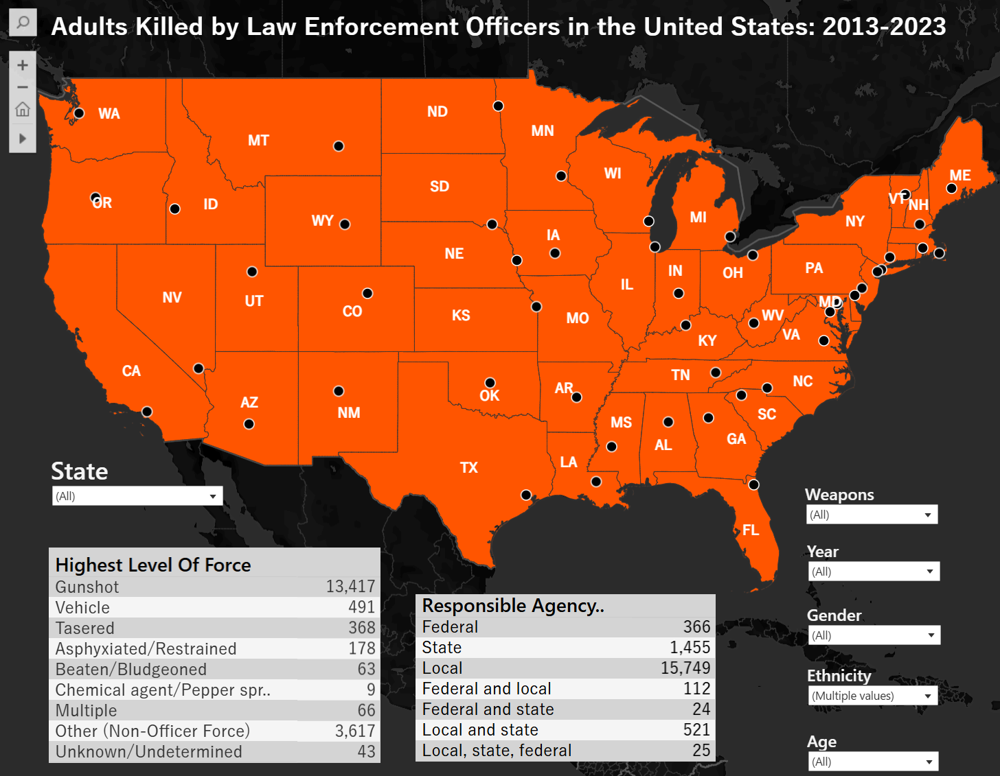

<link rel="stylesheet" href="assets/css/normalize.css">
<link rel="stylesheet" href="assets/css/main.css">
<main id="main"> <!-- Favicon Information -->

<section class="hero">
  

    

      <h1 class="text-center text-2xl font-bold">Interactive Maps</h1>
    

  
<a href="assets/work/accessbc.html" class="index-work-section" id="accessbc">
    
    

        <h2>Access BC</h2>
    

    <ul class="skills">
        <li>Mapbox</li>
        <li>Web-Mapping</li>
        <li>Survey123</li>
        <li>JavaScript</li>
    </ul>
    </a>

  
<a href="assets/work/fatalencounters.html" class="index-work-section" id="fatalencounters">
    
    

        <h2>Fatal Encounters with Police</h2>
    

    <ul class="skills">
        <li>Tableau</li>
        <li>Web-Mapping</li>
        <li>ArcGIS Pro</li>
    </ul>
    </a>

  
<a href="assets/work/mappingukraine.html" class="index-work-section" id="ukraine">
    
    

        <h2>Mapping Tweets in Ukraine</h2>
    

    <ul class="skills">
        <li>Mapbox</li>
        <li>Web-Mapping</li>
        <li>Python</li>
    </ul>
    </a>

  
<a href="work/dul-sharepoint.html" class="index-work-section" id="sharepoint">
    
    

        <h2>DUL UX Sharepoint</h2>
    

    
How do we showcase what UX is?

    <ul class="skills">
        <li>UX Research</li>
        <li>MS 365</li>
        <li>SharePoint</li>
    </ul>
    </a>

      
<a href="work/dul-sharepoint.html" class="index-work-section" id="sharepoint">
    
    

        <h2>DUL UX Sharepoint</h2>
    

    
How do we showcase what UX is?

    <ul class="skills">
        <li>UX Research</li>
        <li>MS 365</li>
        <li>SharePoint</li>
    </ul>
    </a>

          
<a href="work/dul-sharepoint.html" class="index-work-section" id="sharepoint">
    
    

        <h2>DUL UX Sharepoint</h2>
    

    
How do we showcase what UX is?

    <ul class="skills">
        <li>UX Research</li>
        <li>MS 365</li>
        <li>SharePoint</li>
    </ul>
    </a>

</section>